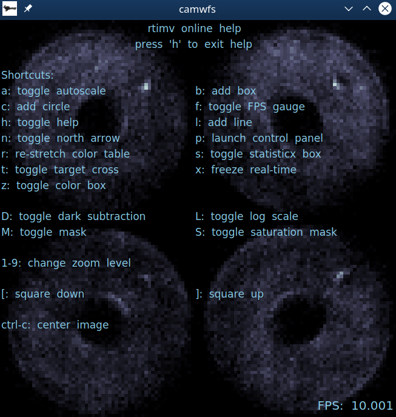
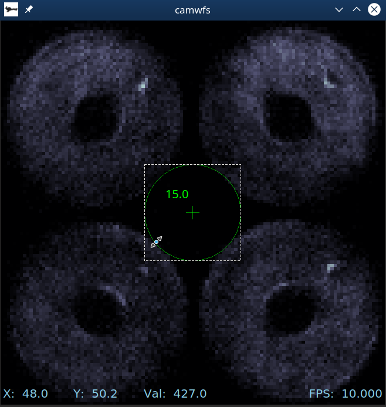
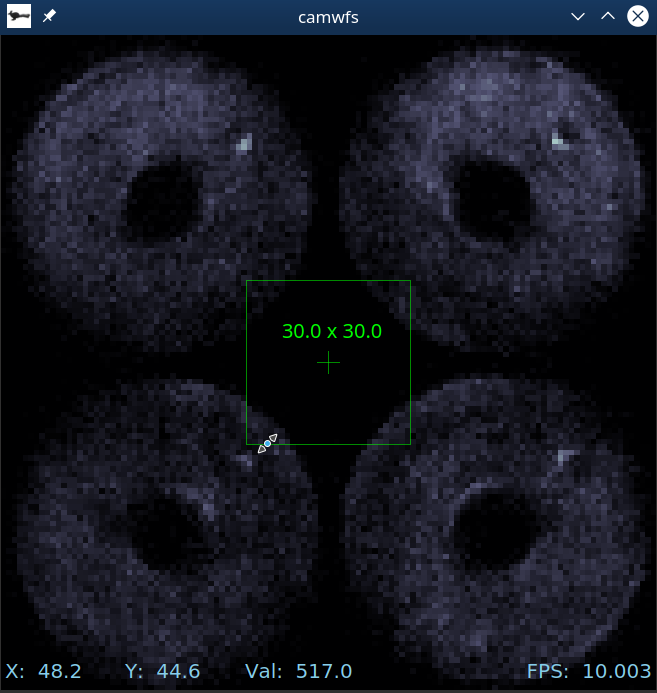
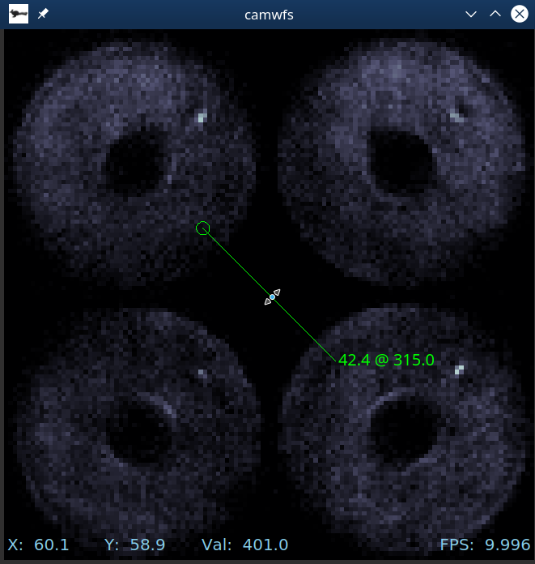

# rtimv User's Guide

An astronomical image viewer optimized for real-time image stream display. Works with MILK/CACAO shared memory image streams locally or via the `milkzmq` protocol.  Will also display local FITS files.

## Basic Startup

The basic way to start `rtimv` is to provide a list of local stream names:
```
$ rtimv image dark mask sat_mask
```
where each of the stream names corresponds to an image, e.g. `image` => `/milk/shm/image.im.shm` (but note that you only pass `image`).  Order matters in this list, and it must be the last thing on the command line (after any options).

These (and many more) can also be specified in a configuration file, or with named command line options, as detailed below under [Configuration](#Configuration).

For a camera named `camname` with an existing configuration file, start `rtimv` with
```
$ rtimv -c /path/to/camname_config.conf
```

## Image Keys

The name and location of an image is specified by its `key`.  The following rules are followed in the given order to determine how to find an image:
- If the `key` ends in `.fits`, `.fit`, `.FITS`, or `.FIT`, then the image is treated as a FITS file stored on local disk with `key` specifying a valid path.
- If the `key` contains `@` or `:`, or the configuration option `--mzmq.always=true` (`-Z`) is set, then the `key` is interpreted as a `milkzmq` address of the form `name@server:port`.  If `mzmq.always` is set, then `@` and `:` are optional. The default server is `localhost` and the default port is `5556`.
- Otherwise, `key` is treated as a local `milk` `shmim` name and the standard path is followed, e.g. `/milk/shm/image.im.shm` for `key=image`.

## Operating rtimv

rtimv lets you adjust color scales and draw shapes for interactive measurement of image features with keyboard shortcuts.

To access the help screen, type `h` after opening rtimv. The [keyboard shortcuts](#Keyboard-Shortcuts) are just the letters shown (without `ctrl` or `alt`) unless noted.



It is possible to add overlays of various shapes to measure distances and sizes. To add a circle, type `c`. You can drag to resize or reposition, and hit the `delete` key to remove. The number shown is the radius in pixels. (You can add another circle by hitting `c` again.)



The `b` key adds a box, which works similarly. Dimensions shown are full-width by full-height.



You can also use `l` to add a line. The numbers shown are `length @ direction` where direction is degrees counter clockwise from North. (or straight up if North is not set). Clicking and and moving the mouse while in the middle rotates it.  If you click and drag the opposite end from the small circle you can change the length and the angle.



In general, if you see the "resize arrows" cursor when your mouse hovers over the shape, clicking and dragging will change the size. If you see the "hand" cursor, it will move the shape. Numbers, shape center indicators, and line end indicators are only shown when your mouse is over that shape.

### Keyboard Shortcuts

| Key     | Action                            | Description      |
|---------|-----------------------------------|------------------|
| `a`     | toggle autoscale                  | autoscale on will update the color table for each imge|
| `b`     | add a box                   | draw a box overlay and show its full width and height |
| `c`     | add a circle                | draw a circle overlay and show its radius |
| `f`     | toggle the FPS gauge               | |
| `h`     | toggle help screen               | |
| `l`     | add a line               | draw a line overlay and show its length and angle relative to North |
| `n`     | toggle display of the North arrow | |
| `p`     | open control panel                | |
| `r`     | re-stretch the display            | reset the min/max in the color table using the current image |
| `s`     | toggle the statistics box         | |
| `t`     | toggle the target cross           | |
| `x`     | freeze the display                | stop updating until `x` is pressed again |
| `z`     | toggle color box                   | the yellow box used for changing the color table limits based on the values inside it |
| `D`     | toggle dark subtraction           | |
| `L`     | toggle log scale                  | |
| `M`     | toggle the mask                   | |
| `S`     | toggle the sat-mask               | |
| `1`-`9` | change the zoom level             | |
| `[`     | fit gui to image, decreasing size | |
| `]`     | fit gui to image, increasing size | |
| `ctrl+c`     | center the display                | |


### Pixel Coordinates and Value 

By default the cuurent (x,y) pixel coordinate of the mouse pointer, and the image value under it, are displayed next to the mouse pointer.  This can be turned off in configuration using `--mouse.pointerCoords=true/false` or with the control panel.  

The mouse coordinates and value can also be displayed in a static location at the lower left of the window.  This can be set in configuration using `--mouse.staticCoords=true/false` or with the control panel.

The displayed coordinate is for the center of a pixel, counting from `0,0` for the center of the lower left pixel.  The center of the array (and default target-cross coordinate) is `(0.5*(Nx-1), 0.5*(Ny-1))`.


## Configuration

rtimv can be configured from the command line or using a config file.
```
$ rtimv --image.key=image --dark.key=dark --mask.key=mask --satMask.key=sat_mask
```
or with a configuration file
```
rtimv -c /path/to/config_file.conf 
```
where the options would be specified in the file as
```
[image]
key=image 

[dark]
key=dark

[mask]
key=mask

[satMask]
key=sat_mask
```
Many more options are available.  

### Configuration Options
| Short | Long                   | Config-File           | Type   | Description |
|-------|------------------------|-----------------------|--------|-------------|
| `-h`  | `--help`               |                       | bool   | Print a help message and exit. |
| `-c`  | `--config`             | `config`              | string | A local config file. If RTIMV_CONFIG_PATH is set that path will be used, otherwise this must be the full path. |
|       | `--autoscale`          | `autoscale`           | bool   | Set to turn autoscaling on at startup (default is off). |
|       | `--nofpsgage`          | `nofpsgage`           | bool   | Set to turn the fps gage off at startup (default is on). |
|       | `--darksub`            | `darksub`             | bool   | Set to false to turn off on at startup.  If a dark is supplied, darksub is otherwise on. |
|       | `--targetXc`           | `targetXc`            | real   | The fractional x-coordinate of the target, 0<= targetXc <=1.    | 
|       | `--targetYc`           | `targetYc`            | real   | The fractional y-coordinate of the target, 0<= targetYc <=1.  |
| `-Z`  | `--mzmq.always`        | `mzmq.always`         | bool   | Set to make milkzmq the protocol for bare image names.  Note that local shmims can not be used if this is set. |
| `-s`  | `--mzmq.server`        | `mzmq.server`         | int    | The default server for milkzmq.  The default default is localhost.  This will be overridden by an image specific server specified in a key. |     
| `-p`  | `--mzmq.port`          | `mzmq.port`           | string | The default port for milkzmq.  The default default is 5556.  This will be overridden by an image specific port specified in a key.
|       | `--image.key`          | `image.key`           | string | The main image key. Specifies the protocol, location, and name of the main image. |
|       | `--dark.key`           | `dark.key`            | string | The dark image key. Specifies the protocol, location, and name of the dark image. |
|       | `--mask.key`           | `mask.key`            | string | The mask image key. Specifies the protocol, location, and name of the mask image. |
|       | `--satMask.key`        | `satMask.key`         | string | The satMask image key. Specifies the protocol, location, and name of the satMask image. |
|       | `--mouse.pointerCoords`| `mouse.pointerCoords` | bool   | Show or don't show the pointer coordinates.  Default is true. |
|       | `--mouse.staticCoords` | `mouse.staticCoords`  | bool   | Show or don't show the static coordinates at bottom of display.  Default is false. |
|       | `--north.enabled`      | `north.enabled`       | bool   | Whether or not to enable the north arrow. Default is true. |
|       | `--north.offset`       | `north.offset`        | float  | Offset in degrees c.c.w. to apply to the north angle. Default is 0. |
|       | `--north.scale`        | `north.scale`         | float  | Scaling factor to apply to north angle to convert to degrees c.c.w. on the image.  Default is -1. |

The Config-File options of the form `section.keyword` specify the form
```
[section]
keyword=value
```
in the configuration file.

The path to `config_file.conf` can be specified via the environment variable `RTIMV_CONFIG_PATH`, in which case the path can be ommitted.  If set, this path will be added to the front of the filename specified with the `-c` or `--config` command line option. 

Settings on the command line override settings in the config file.  So the same config file could be used for several images, changing only the image name on the command line for instance.


## North Arrow
The north arrow is toggled on/off with the `n` key.  If the angle of the north arrow is being updated (i.e. from a plugin that talks to the telescope)
the value received is multiplied by a scale (e.g. -1 or 180/pi) and then an offset (in degrees) is added to the result to produce
a counter clockwise (c.c.w.) rotation angle in degrees.

The north arrow can be disabled in configuration.  If `north.enabled=false` is set, the north arrow will not be displayed.

Relevant configuration key=value pairs are
- `north.enabled=true/false`: Whether or not to enable the north arrow. Default is true.
- `north.offset=float`: Offset in degrees c.c.w. to apply to the north angle. Default is 0.
- `north.scale=float`: Scaling factor to apply to north angle to convert to degrees c.c.w. on the image.  Default is -1.
