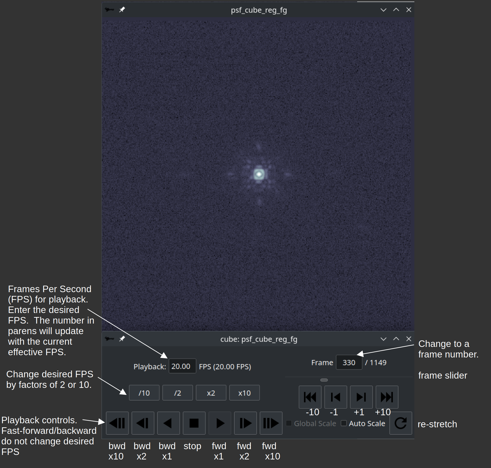
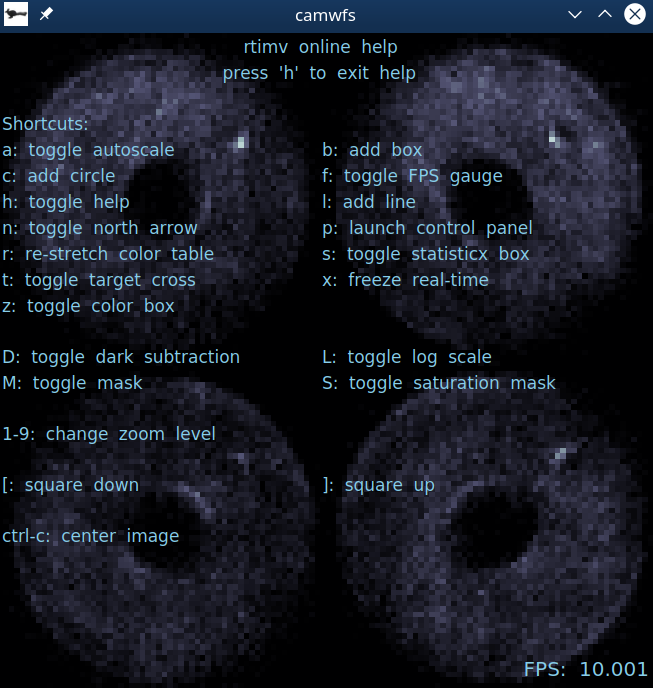
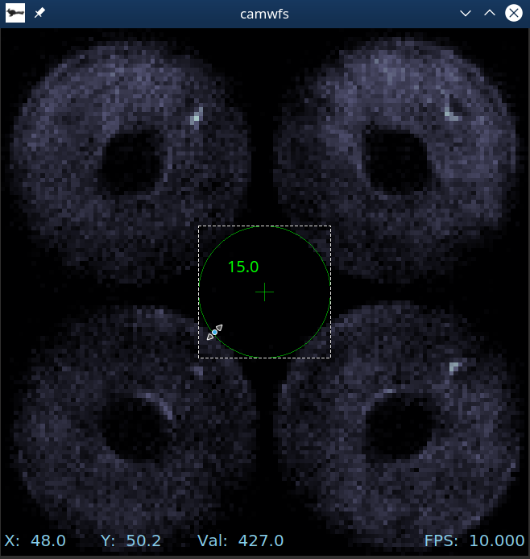
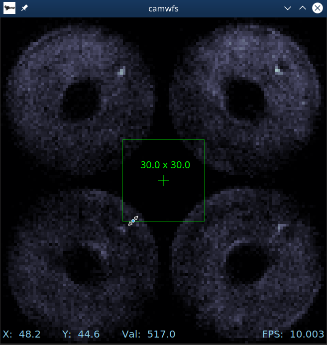
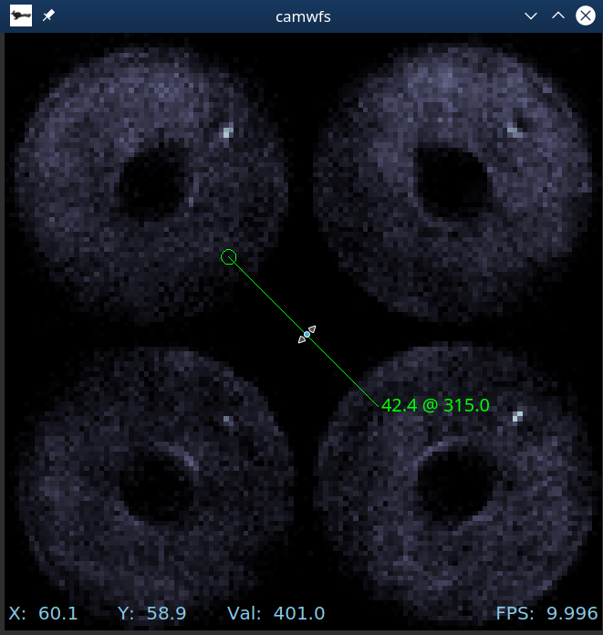

# User's Guide

`rtimv` is an astronomical image viewer optimized for real-time image stream display. Works with MILK/CACAO shared memory image streams locally or via the `milkzmq` protocol.  Will also display local FITS files, updating anytime the file is updated.

## Basic Startup

There are two ways to start the `rtimv` window:
- `rtimv`: local viewer process (reads images directly from shmim/FITS/mzmq keys).
- `rtimvClient`: client UI connected to a remote `rtimvServer`.

The basic way to start either `rtimv` or `rtimvClient` is to provide a list of local stream names:
```
$ rtimv image dark mask sat_mask
```
where each of the stream names corresponds to an image, e.g. `image` => `/milk/shm/image.im.shm` (but note that you only pass `image`).  Order matters in this list, and it must be the last thing on the command line (after any options).

These (and many more) can also be specified in a configuration file, or with named command line options, as detailed below under [Configuration](#Configuration).

For a camera named `camname` with an existing configuration file, start `rtimv` with
```
$ rtimv -c /path/to/camname_config.conf
```

To start the remote client UI specifying the server:
```
$ rtimvClient --server=127.0.0.1 --port=7000
```
Note the options shown are actually the defaults so you don't need to do this unless they are different.

You can also specify a config file like so:
```
$ rtimvClient -c /path/to/client.conf
```
but this is somewhat different than for local `rtimv`.  This config file path will be passed to the server.  But first, if that file exists locally it is read and used to configure the client first.  Any differences between the client and server versions of that file are resolved in favor of the client.

## Image Keys

The name and location of an image is specified by its `key`.  The following rules are followed in the given order to determine how to find an image:
- If the `key` ends in `.fits`, `.fit`, `.FITS`, or `.FIT`, then the image is treated as a FITS file stored on local disk with `key` specifying a valid path.
- if the `key` ends in `/`, e.g. `/path/to/directory/`, then rtimv will treat the FITS files in that directory as a cube, enabling playback and incrementing through the images in lexical sort order.
- If the `key` contains `@` or `:`, or the configuration option `--mzmq.always=true` (`-Z`) is set, then the `key` is interpreted as a `milkzmq` address of the form `name@server:port`.  If `mzmq.always` is set, then `@` and `:` are optional. The default server is `localhost` and the default port is `5556`.
- Otherwise, `key` is treated as a local `milk` `shmim` name and the standard path is followed, e.g. `/milk/shm/image.im.shm` for `key=image`.

## Cube Mode

If a FITS file containing an image cube (NAXIS3 > 1) is opened, rtimv will automatically enter cube mode.  This enables playback of the cube at varying speeds, as well as switching between frames.  

Cube mode can also be entered by pointing rtimv at a directory containing multiple FITS files.  This mode is entered anytime the image key ends in `/`.

The FPS of playback in cube mode is determined both by the entered "desired" FPS, and the overal update timeout.  The update timeout takes precedence to ensure that rtimv is responsive to image updates.  This results in not necessarily obtaining the desired FPS for cube playback if `FPS < 1/update_timeout`.  The cube control GUI will show the effective FPS compared to the desired FPS.

Cube playback and frame position controlled by the Cube Control GUI.  This opens automatically when a cube is opened, and can be toggles with the `C` shortcut.  The GUI is illustrated below.



## Operating rtimv

rtimv lets you adjust color scales and draw shapes for interactive measurement of image features with keyboard shortcuts.

To access the help screen, type `h` after opening rtimv. The [keyboard shortcuts](#Keyboard-Shortcuts) are just the letters shown (without `ctrl` or `alt`) unless noted.



When using `rtimvClient`, JPEG transport quality can also be adjusted with `Q` and `q`, or from the control panel.

It is possible to add overlays of various shapes to measure distances and sizes. To add a circle, type `c`. You can drag to resize or reposition, and hit the `delete` key to remove. The number shown is the radius in pixels. (You can add another circle by hitting `c` again.)



The `b` key adds a box, which works similarly. Dimensions shown are full-width by full-height.



You can also use `l` to add a line. The numbers shown are `length @ direction` where direction is degrees counter clockwise from North. (or straight up if North is not set). Clicking and and moving the mouse while in the middle rotates it.  If you click and drag the opposite end from the small circle you can change the length and the angle.



In general, if you see the "resize arrows" cursor when your mouse hovers over the shape, clicking and dragging will change the size. If you see the "hand" cursor, it will move the shape. Numbers, shape center indicators, and line end indicators are only shown when your mouse is over that shape.

### Keyboard Shortcuts

| Key | Action | Description |
|-----|--------|-------------|
| `a` | toggle autoscale | Autoscale updates the color table from each new image. |
| `b` | add a box | Draw a box overlay and show its full width and height. |
| `c` | add a circle | Draw a circle overlay and show its radius. |
| `f` | toggle the FPS gauge | Show or hide the FPS display. |
| `h` | toggle help screen | Show or hide the online help overlay. |
| `i` | toggle info screen | Show or hide the info overlay. |
| `l` | add a line | Draw a line overlay and show its length and angle relative to North. |
| `n` | toggle display of the North arrow | Show or hide the north arrow when enabled. |
| `p` | open control panel | Open the main control panel window. |
| `q` | lower JPEG quality | `rtimvClient` only. Lower remote JPEG transport quality by 5. |
| `r` | re-stretch the display | Reset the min/max in the color table using the current image. |
| `s` | toggle the statistics box | Show or hide the statistics box overlay. |
| `t` | toggle the target cross | Show or hide the target cross. |
| `x` | freeze the display | Stop updating until `x` is pressed again. |
| `z` | toggle color box | Toggle the yellow box used to set color-table limits from the values inside it. |
| `C` | toggle cube control GUI | Opens automatically when a cube is opened. |
| `D` | toggle dark subtraction | Enable or disable dark subtraction. |
| `F` | toggle spatial filtering | Toggle the currently configured filters. Configure them on the control panel. |
| `L` | toggle log scale | Switch between linear and log stretch. |
| `M` | toggle the mask | Enable or disable mask application. |
| `Q` | raise JPEG quality | `rtimvClient` only. Raise remote JPEG transport quality by 5. |
| `S` | toggle the sat-mask | Enable or disable the saturation mask. |
| `1`-`9` | change the zoom level | Set the zoom level directly. |
| `[` | fit GUI to image, decreasing size | Match the image aspect ratio by decreasing the larger displayed dimension. |
| `]` | fit GUI to image, increasing size | Match the image aspect ratio by increasing the smaller displayed dimension. |
| `ctrl +` | zoom in | Increase zoom by 0.1. |
| `ctrl -` | zoom out | Decrease zoom by 0.1. |
| `ctrl+c` | center the display | Center the displayed image. |
| `delete` | remove selected object | Remove the currently selected overlay item. |


### Pixel Coordinates and Value 

By default the current (x,y) pixel coordinate of the mouse pointer, and the image value under it, are displayed next to the mouse pointer.  This can be turned off in configuration using `--mouse.pointerCoords=true/false` or with the control panel.  

The mouse coordinates and value can also be displayed in a static location at the lower left of the window.  This can be set in configuration using `--mouse.staticCoords=true/false` or with the control panel.

The displayed coordinate is for the center of a pixel, counting from `0,0` for the center of the lower left pixel.  The center of the array (and default target-cross coordinate) is `(0.5*(Nx-1), 0.5*(Ny-1))`.


## Configuration

`rtimv` and `rtimvClient` can both be configured from the command line or using a local config file. Above
we showed the from with positional arguments for the keys.  They can also be passed as option arguments:
```
$ rtimv --image.key=image --dark.key=dark --mask.key=mask --satMask.key=sat_mask
```
or with a configuration file
```
rtimv -c /path/to/config_file.conf 
```
where the options would be specified in the file as
```
[image]
key=image 

[dark]
key=dark

[mask]
key=mask

[satMask]
key=sat_mask
```
Many more options are available.  

### Configuration With `rtimvClient` and `rtimvServer`

When using `rtimvClient`, there are two configuration scopes:
- Local client configuration (`rtimvClient` command line and local `-c` file).
- Remote server-side configuration applied by `rtimvServer`.

In practice, the precedence is:
1. `rtimvClient` command line
2. `rtimvClient` local config file (`-c`)
3. remote server configuration (used when local settings are not provided)

This means local client overrides always win for options/keys set locally, while remote configuration can still provide defaults (including image metadata shown in the window title/info panel).

### Configuration Options
| Short | Long | Config-File | Type | Description |
|-------|------|-------------|------|-------------|
| `-h` | `--help` |  | bool | Print a help message and exit. |
| `-c` | `--config` | `config` | string | A local config file. If `RTIMV_CONFIG_PATH` is set that path will be used, otherwise this must be the full path. |
| `-S` | `--server` | `server` | string | IP address of the `rtimv` gRPC server. `rtimvClient` only. |
| `-P` | `--port` | `port` | int | Port of the `rtimv` gRPC server. `rtimvClient` only. |
|  | `--image.key` | `image.key` | string | The main image key. Specifies the protocol, location, and name of the main image. |
|  | `--dark.key` | `dark.key` | string | The dark image key. Specifies the protocol, location, and name of the dark image. |
|  | `--mask.key` | `mask.key` | string | The mask image key. Specifies the protocol, location, and name of the mask image. |
|  | `--satMask.key` | `satMask.key` | string | The saturation mask image key. Specifies the protocol, location, and name of the saturation mask image. |
|  | `--update.fps` | `update.fps` | real | Specify the image update timeout in FPS. Overridden by `update.timeout` if set. |
|  | `--update.timeout` | `update.timeout` | real | Specify the image update timeout in ms. Default is 50 ms (20 FPS). Overrides `update.fps`. |
|  | `--update.cubeFPS` | `update.cubeFPS` | real | Specify the image cube update rate in FPS. Default is 20 FPS. |
|  | `--update.rollingStatsFrames` | `update.rollingStatsFrames` | int | Number of frames used for rolling averages of compression ratio and frame rate. `rtimvClient` only. Default is 10. |
|  | `--quality` | `quality` | int | JPEG transport quality for the remote image stream. `rtimvClient` only. Range is 0 to 100. |
|  | `--autoscale` | `autoscale` | bool | Turn autoscaling on at startup. |
|  | `--nofpsgage` | `nofpsgage` | bool | Turn the FPS gauge off at startup. |
|  | `--darksub` | `darksub` | bool | Set to false to turn off dark subtraction at startup. If a dark is supplied, `darksub` is otherwise on. |
|  | `--satLevel` | `satLevel` | float | The saturation level for this camera. |
|  | `--masksat` | `masksat` | bool | Set to false to turn off saturation masking at startup. If a saturation mask is supplied, `masksat` is otherwise on. |
|  | `--targetXc` | `targetXc` | float | The fractional x-coordinate of the target, `0 <= x <= 1`. |
|  | `--targetYc` | `targetYc` | float | The fractional y-coordinate of the target, `0 <= y <= 1`. |
| `-Z` | `--mzmq.always` | `mzmq.always` | bool | Make `milkzmq` the protocol for bare image names. Local shmims can not be used if this is set. |
| `-s` | `--mzmq.server` | `mzmq.server` | string | Default server for `milkzmq`. The default default is `localhost`. Overridden by an image-specific server specified in a key. |
| `-p` | `--mzmq.port` | `mzmq.port` | int | Default port for `milkzmq`. The default default is `5556`. Overridden by an image-specific port specified in a key. |
|  | `--mouse.pointerCoords` | `mouse.pointerCoords` | bool | Show or do not show the pointer coordinates. Default is true. |
|  | `--mouse.staticCoords` | `mouse.staticCoords` | bool | Show or do not show the static coordinates at the bottom of the display. Default is false. |
|  | `--north.enabled` | `north.enabled` | bool | Whether or not to enable the north arrow. Default is true. |
|  | `--north.offset` | `north.offset` | float | Offset in degrees c.c.w. to apply to the north angle. Default is 0. |
|  | `--north.scale` | `north.scale` | float | Scaling factor to apply to north angle to convert to degrees c.c.w. on the image. Default is -1. |
|  | `--tools.lineWidth` | `tools.lineWidth` | float | Width of lines in user items in screen pixels. Default is 2. |
|  | `--tools.edgeTol` | `tools.edgeTol` | float | Tolerance in screen pixels for the mouse to be on the edge of a user item. For closed shapes this applies only to the inside. Default is 5.5. |
|  | `--tools.lineHeadRad` | `tools.lineHeadRad` | float | Radius of the circle marking the head of a user line, in screen pixels. Default is 10. |
|  | `--tools.crossWidthFract` | `tools.crossWidthFract` | float | Half-width of the center cross, relative to the smallest dimension of the tools. Default is 0.1. |
|  | `--tools.crossWidthMin` | `tools.crossWidthMin` | float | Minimum half-width of the center cross, in screen pixels. Default is 5. |
|  | `--tools.warningBorderWidth` | `tools.warningBorderWidth` | float | Width of the warning border in screen pixels. Default is 5. |
|  | `--log.appname` | `log.appname` | bool | Set true or false to include or exclude the called program name in log prefixes. |
|  | `--no-log-appname` | `no-log-appname` | bool | Disable the called program name in log prefixes. |

The Config-File options of the form `section.keyword` specify the form
```
[section]
keyword=value
```
in the configuration file.

Settings on the command line override settings in the config file.  So the same config file could be used for several images, changing only the image name on the command line for instance.

### Config Path Environment Variable

For `rtimv` and `rtimvClient`, the environment variable `RTIMV_CONFIG_PATH` can be used to provide a base path for the config file named with `-c`/`--config`.

If `RTIMV_CONFIG_PATH` is set, the supplied config filename does not need to be an absolute path. The value of `RTIMV_CONFIG_PATH` is prepended to the filename provided with `-c`.

## Server Configuration

`rtimvServer` is configured independently from the `rtimv`/`rtimvClient` window applications.

Typical startup is:
```
$ rtimvServer -c /path/to/rtimvServer.conf
```

### Server Configuration Options
| Short | Long | Config-File | Type | Description |
|-------|------|-------------|------|-------------|
| `-h` | `--help` |  | bool | Print a help message and exit. |
| `-c` | `--config` | `config` | string | A local config file. If `RTIMV_CONFIG_PATH` is set that path will be used, otherwise this must be the full path. |
| `-p` | `--server.port` | `server.port` | int | Port the gRPC server listens on. |
|  | `--server.address` | `server.address` | string | Host or interface address the gRPC server listens on. |
|  | `--image.timeout` | `image.timeout` | real | Time to wait for a new image to be ready before timing out, in s. Default is 1 s. |
|  | `--image.sleep` | `image.sleep` | int | Time to sleep while waiting for a new image, in ms. Default is 100 ms. |
|  | `--client.sleep` | `client.sleep` | real | Time in seconds after which a thread with no requests will be put to sleep. Default is 10 s. |
|  | `--client.disconnect` | `client.disconnect` | real | Time in seconds after which a thread with no requests will be disconnected. Default is 120 s. |
|  | `--quality` | `quality` | int | Default JPEG quality for served images when no per-image quality is configured. Range is 0 to 100. |
|  | `--log.appname` | `log.appname` | bool | Set true or false to include or exclude the called program name in log prefixes. |
|  | `--no-log-appname` | `no-log-appname` | bool | Disable the called program name in log prefixes. |

Example server configuration file:
```
[server]
port=7000
address=0.0.0.0

[image]
timeout=1
sleep=100

[client]
sleep=10
disconnect=120

quality=50
```

### Config Path Environment Variable

`rtimvServer` also uses `RTIMV_CONFIG_PATH` in the same way as the window applications: it prepends this path to the filename provided with `-c`/`--config`.

When `rtimvServer` is run under `systemd`, shell startup files (for example `~/.bashrc` or `~/.bash_aliases`) are not sourced automatically. For service-managed deployments, set `RTIMV_CONFIG_PATH` through the unit environment (for example via `EnvironmentFile=`). The installed unit defaults to:
`EnvironmentFile=-/etc/default/rtimvServer`.

## North Arrow
The north arrow is toggled on/off with the `n` key.  If the angle of the north arrow is being updated (i.e. from a plugin that talks to the telescope)
the value received is multiplied by a scale (e.g. -1 or 180/pi) and then an offset (in degrees) is added to the result to produce
a counter clockwise (c.c.w.) rotation angle in degrees.

The north arrow can be disabled in configuration.  If `north.enabled=false` is set, the north arrow will not be displayed.

Relevant configuration key=value pairs are
- `north.enabled=true/false`: Whether or not to enable the north arrow. Default is true.
- `north.offset=float`: Offset in degrees c.c.w. to apply to the north angle. Default is 0.
- `north.scale=float`: Scaling factor to apply to north angle to convert to degrees c.c.w. on the image.  Default is -1.
